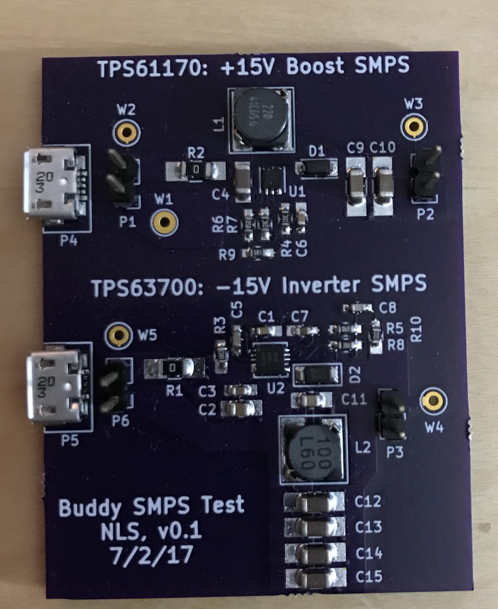

# dual_rail_smps

A dual +15/-15V rail SMPS test board using the TI tps61170 and tps63700 designed in KiCad.  Includes source, BOM, and zipped manufacturing and stencil files.

The kicad_libs [library](https://github.com/shraken/kicad_libs) is required.

